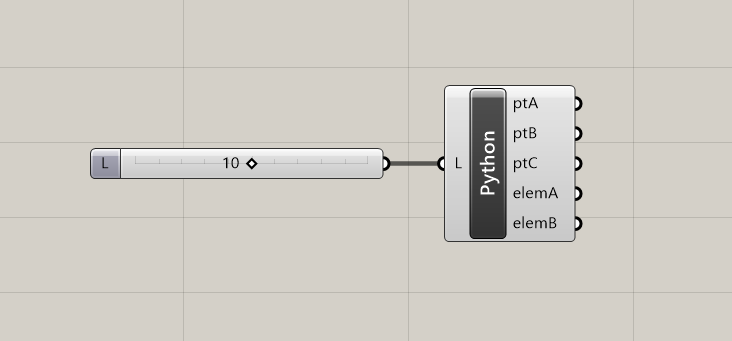

# 演習1（構造）
## 1. 演習課題
以下のような単純梁をGrasshopper + Karamba3Dで解析します。


## 2. Grasshopperによる描画


grasshopper上で節点及び線を描画します。

点A　原点（ 0, 0, 0 )

点B　AC間の中心（ L / 2, 0, 0 )

点C　　　（ L, 0, 0 )

スパンLはNumberSliderでパラメーターとして設定します。


### 2.1 コンポーネントの配置例1

コンポーネントのみで配置した例


使用コンポーネント

・Panel

・Division(Maths → Opeators)

・Number Slider(Params → Input)

・Construction Point(Vector → Point)

・Line(Curve → Primitive)

### 2.2 コンポーネントの配置例2

ghPythonを使用した例



ghPythonではジオメトリを格納した変数をコンポーネントの出力変数名に一致させる必要があります。

```python
import rhinoscriptsyntax as rs

# 座標の定義（タプルで定義します。リストでも可）
crdA = (  0,0,0)
crdB = (L/2,0,0)
crdC = (  L,0,0)

# 節点の定義
ptA = rs.AddPoint(crdA) 
ptB = rs.AddPoint(crdB)
ptC = rs.AddPoint(crdC)

# 要素（LINE）の定義
elemAB = rs.AddLine( crdA, crdB )
elemBC = rs.AddLine( crdB, crdC )

```

## 3. Karamba3Dによる解析


1.支点（境界条件）の定義

2.要素の定義

3.材料の定義（鉄骨）

4.断面形状の定義（H形鋼）

5.分布荷重の設定

6.解析モデルの構築

7.解析

8.出力（モデル及び梁要素）


使用コンポーネント

・Support(Karamba3D → Model)

・LineToBeam(Karamba3D → Model)

・MaterialSection(Karamba3D → Materials)

・CrossSection(Karamba3D → Cross Section)

・Loads(Karamba3D → Load)

・Assemble(Karamba3D → Algorithms)

・Analyze(Karamba3D → Algorithms)

・Model View(Karamba3D → Results)

・Beam View(Karamba3D → Results)

## 4.検証

解析結果が出たら中央の曲げモーメント及び中央（B点）の変形量について検証を行います。
検証に使う断面二次モーメントはIx=22965cm<sup>4</sup>とします。

単純梁の最大（中央部）の曲げモーメント


中央部の変形


ここに
スパン：L、分布荷重：w、ヤング係数：E、断面二次モーメント：I

各自、手計算（電卓・Excelなど）で検証してみましょう。

※ 手計算ではせん断変形の影響を無視していますので、変形は若干小さめになります。
