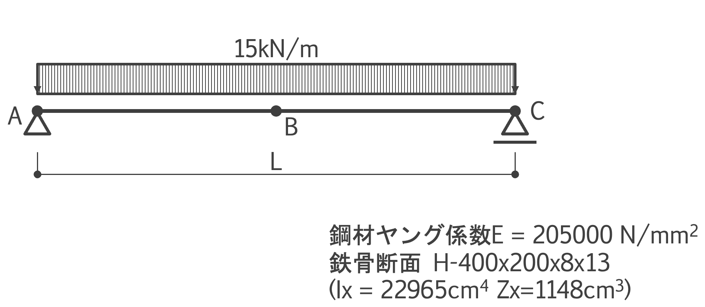
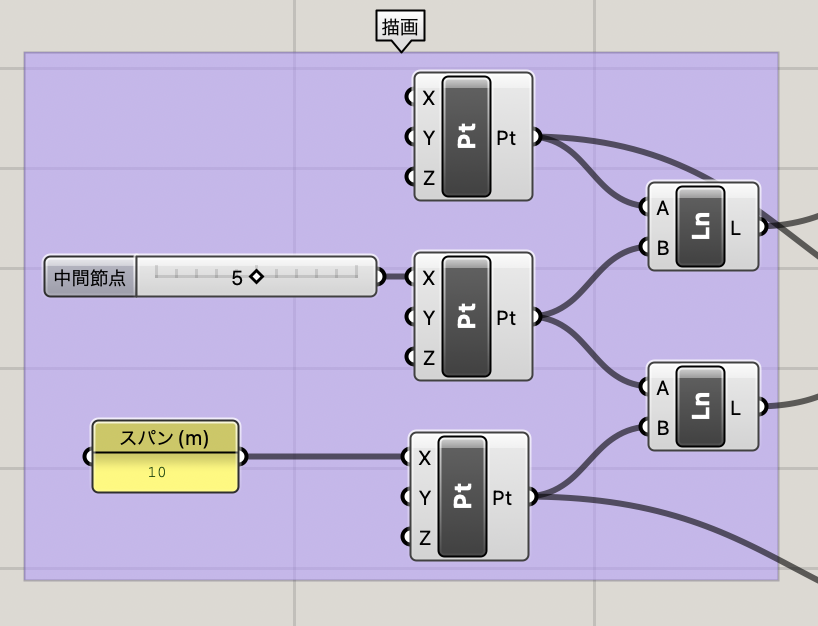
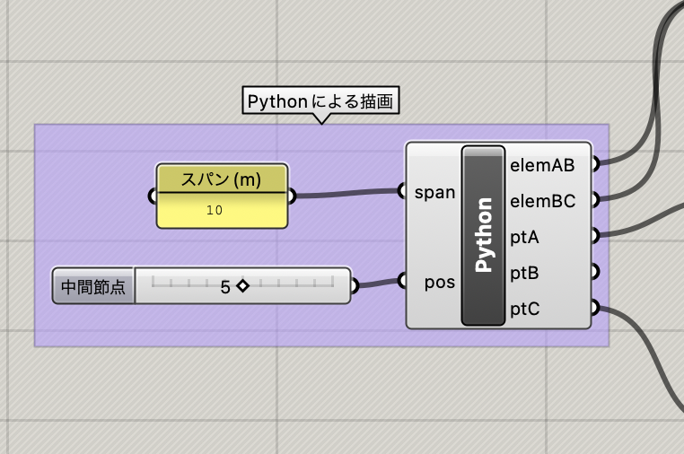
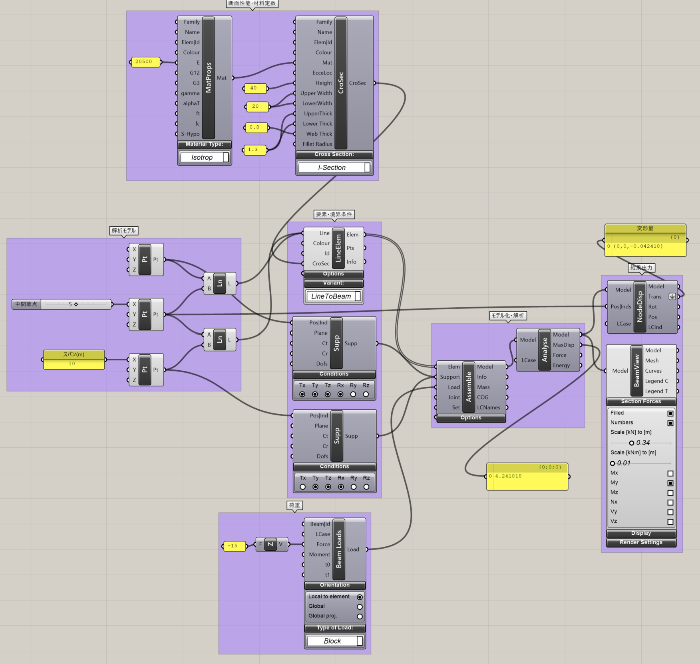

デジタルエンジニアリング特論 構造演習1
- [1. 演習課題](#1-演習課題)
- [2. Grasshopperによる描画](#2-grasshopperによる描画)
  - [2.1. コンポーネントの配置例1](#21-コンポーネントの配置例1)
  - [2.2. コンポーネントの配置例2](#22-コンポーネントの配置例2)
- [3. Karamba3Dによる解析](#3-karamba3dによる解析)
- [4. 検証](#4-検証)

# 1. 演習課題
以下のような単純梁をGrasshopper + Karamba3Dで解析します。



スパンL=10.0m

A点はピン支持、B点はピンローラー支持

鋼材種別SS400(F = 235N/mm<sup>2</sup>)

鋼材のヤング係数E=205000N/mm<sup>2</sup>

断面 H - 400 x 200 x 8 x 13 ( Ix=22965cm<sup>4</sup> Zx = 1148cm<sup>3</sup>)

# 2. Grasshopperによる描画

grasshopper上で節点及び線を描画します。


点A　原点（ 0, 0, 0 )

点B　AC間の任意の位置（ p , 0, 0 ) 0 < p < 10

点C　　　（ 10, 0, 0 )

点Bの位置はNumberSliderでパラメーターとして設定します。


## 2.1. コンポーネントの配置例1

コンポーネントのみで配置した例



使用コンポーネント

・Panel

・Construction Point(Vector → Point)

・Number Slider(Params → Input)

・Line(Curve → Primitive)

## 2.2. コンポーネントの配置例2

ghPythonを使用した例



ghPythonではジオメトリを格納した変数をコンポーネントの出力変数名に一致させる必要があります。

```python
import rhinoscriptsyntax as rs

# 文字列を数値化(ghpythonではpanelからの入力は文字となる)
L = float(span) 

# 節点座標の定義（タプルで定義します。リストで定義してもも可）
crdA = (  0,0,0)
crdB = (pos,0,0)
crdC = (  L,0,0)

# 節点追加(Point)
ptA = rs.AddPoint(crdA) 
ptB = rs.AddPoint(crdB)
ptC = rs.AddPoint(crdC)

# 要素追加（Line）
elemAB = rs.AddLine( crdA, crdB )
elemBC = rs.AddLine( crdB, crdC )
```

# 3. Karamba3Dによる解析


1.支点（境界条件）の定義

2.要素の定義

3.材料の定義（鉄骨）

4.断面形状の定義（H形鋼）

5.分布荷重の設定

6.解析モデルの構築

7.解析

8.出力（モデル及び梁要素）




使用コンポーネント

・Support(Karamba3D → Model)

・LineToBeam(Karamba3D → Model)

・MaterialSection(Karamba3D → Materials)

・CrossSection(Karamba3D → Cross Section)

・Loads(Karamba3D → Load)

・Assemble(Karamba3D → Algorithms)

・Analyze(Karamba3D → Algorithms)

・Model View(Karamba3D → Results)

・Beam View(Karamba3D → Results)

# 4. 検証

解析結果が出たら支点反力、中央の曲げモーメント及び中央の変形量について検証を行います。
単純梁の中央曲げモーメントと変形は実務で最も使う構造力学の公式の一つです。

単純梁の最大（中央部）の曲げモーメント


中央部の変形


ここに

スパン：L、分布荷重：w、ヤング係数：E、断面二次モーメント：I

各自、手計算（電卓・Excelなど）で検証してみましょう。

※ 手計算ではせん断変形の影響を無視していますので、変形は若干小さめになります。
