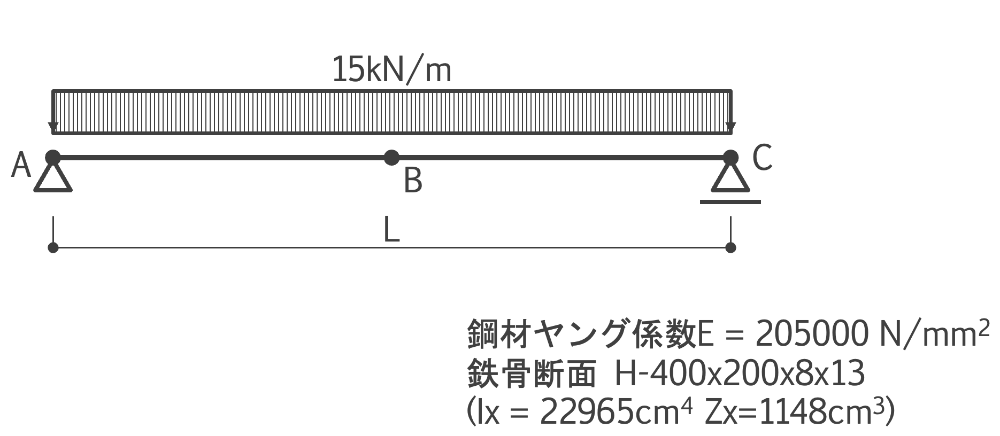
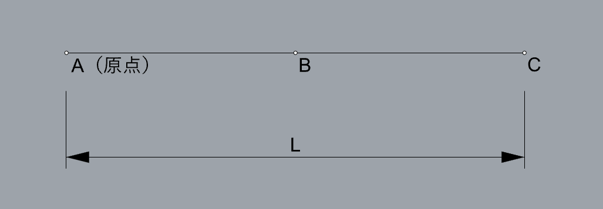
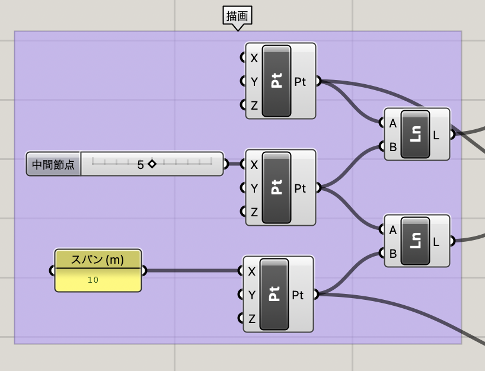
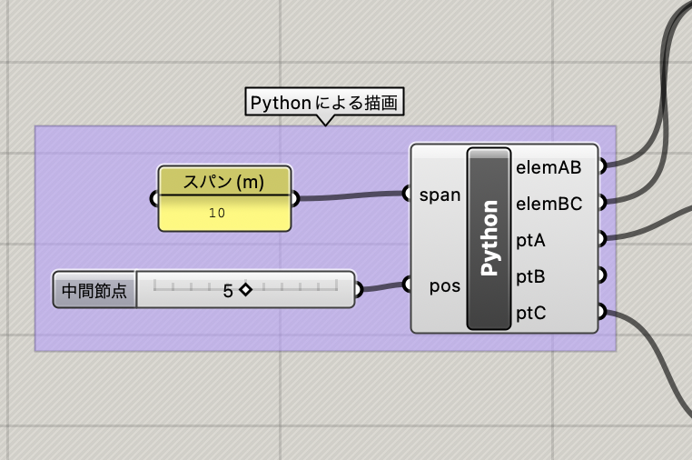
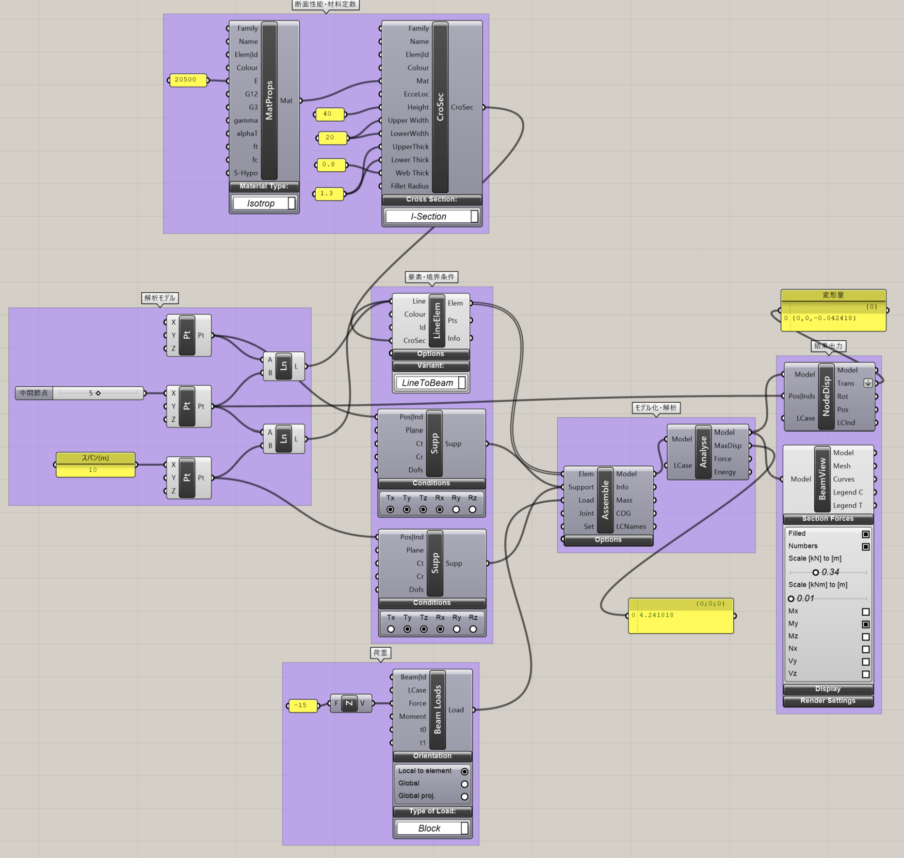

デジタルエンジニアリング特論 構造演習1
- [1. 演習課題](#1-演習課題)
- [2. Grasshopperによる描画](#2-grasshopperによる描画)
  - [2.1. コンポーネントの配置例1](#21-コンポーネントの配置例1)
  - [2.2. コンポーネントの配置例2](#22-コンポーネントの配置例2)
- [3. Karamba3Dによる解析](#3-karamba3dによる解析)
- [4. 検証](#4-検証)

# 1. 演習課題
以下のような単純梁をGrasshopper + Karamba3Dで解析します。



スパンL=10.0m

A点はピン支持、C点はピンローラー支持、ACの中間点をB点とする

鋼材種別SS400(F = 235N/mm<sup>2</sup>)

鋼材のヤング係数E=205000N/mm<sup>2</sup>

断面 H - 400 x 200 x 8 x 13 ( Ix=22965cm<sup>4</sup> Zx = 1148cm<sup>3</sup>)

# 2. Grasshopperによる描画

grasshopper上で節点及び線を描画します。



点A　原点（ 0, 0, 0 )

点B　AC間の任意の位置（ p , 0, 0 ) 0 < p < 10

点C　　　（ 10, 0, 0 )

点Bの位置はNumberSliderでパラメーターとして設定します。


## 2.1. コンポーネントの配置例1

コンポーネントのみで配置した例



使用コンポーネント

・Panel

・Construction Point(Vector → Point)

・Number Slider(Params → Input)

・Line(Curve → Primitive)

## 2.2. コンポーネントの配置例2

ghPythonを使用した例



ghPythonではジオメトリを格納した変数をコンポーネントの出力変数名に一致させる必要があります。

```python
import rhinoscriptsyntax as rs

# 文字列を数値化(ghpythonではpanelからの入力は文字となる)
L = float(span) 

# 節点座標の定義（タプルで定義します。リストで定義してもも可）
crdA = (  0,0,0)
crdB = (pos,0,0)
crdC = (  L,0,0)

# 節点追加(Point)
ptA = rs.AddPoint(crdA) 
ptB = rs.AddPoint(crdB)
ptC = rs.AddPoint(crdC)

# 要素追加（Line）
elemAB = rs.AddLine( crdA, crdB )
elemBC = rs.AddLine( crdB, crdC )
```

# 3. Karamba3Dによる解析

Karamba3Dではgrasshopperで描画した線分を解析する要素とみなしてモデル化を行うことが可能です。

今回は非常にシンプルな形状をモデル化しますが、grasshopperで生成した複雑な形状をモデル化できるところに大きな特徴があります。
grasshopperはパラメトリックに座標や部材断面を変更することが可能で、karambaはリアルタイムにその結果を反映して表示できます。

架構形状以外の境界条件・部材断面・荷重などは別途定義する必要があります。設定する項目は一般的なソフトウェアも同じです。

1.架構の定義
1.1 節点および部材要素
1.2.支点（境界条件）

2.部材断面の定義
2.1 材料（鉄骨）
2.2 断面形状（H形鋼）

3.荷重の定義
3.1 分布荷重

4.解析モデルの構築
5.解析
6.結果出力




# 4. 検証

解析結果が出たら支点反力、中央の曲げモーメント及び中央の変形量について検証を行います。
単純梁の中央曲げモーメントと変形は実務で最も使う構造力学の公式の一つです。

単純梁の最大（中央部）の曲げモーメント


中央部の変形


ここに

スパン：L、分布荷重：w、ヤング係数：E、断面二次モーメント：I

各自、手計算（電卓・Excelなど）で検証してみましょう。

※ 手計算ではせん断変形の影響を無視していますので、変形は若干小さめになります。


追記

変形 δ(cm)

断面2次モーメントI(cm<sup>2</sup>)

スパンL(m)

分布荷重w(kN/m)

鋼材のヤング係数E=205000N/mm<sup>2</sup>=20500kN/cm<sup>2</sup>

とし、kNおよびcmで換算すると、以下のような簡単な式になります。（単位が混在するので注意が必要）

$$
\delta=\frac{ 5 \cdot 0.01 w \cdot (100 \cdot L)^{4} }{384 \cdot 20500 \cdot I}
=0.635 \frac{w L^{4}}{I}
$$

openseespyによる解析

https://colab.research.google.com/gist/Tatsuru-Mihashi/fbf4935be7e1ca30c6d43ebd5b31dd8f/sample_openseespy.ipynb#scrollTo=mvDJYuTua8Xr

$$
\mathbf{F} = \mathbf{K}\mathbf{x}
$$

$$
\mathbf{x} =
\begin{bmatrix}
u_1 \\
v_1 \\
\theta_1 \\
u_2 \\
v_2 \\
\theta_2 \\
u_3 \\
v_3 \\
\theta_3
\end{bmatrix}
$$

$$
\mathbf{F} =
\begin{bmatrix}
0 \\
-\frac{w\ell}{2} \\
-\frac{w\ell^2}{12} \\
0 \\
-w\ell \\
0 \\
0 \\
-\frac{w\ell}{2} \\
\frac{w\ell^2}{12}
\end{bmatrix}
$$

$$
\mathbf{K} =
\begin{bmatrix}
\frac{EA}{\ell} & 0 & 0 & -\frac{EA}{\ell} & 0 & 0 & 0 & 0 & 0 \\
0 & \frac{12EI}{\ell^3} & \frac{6EI}{\ell^2} & 0 & -\frac{12EI}{\ell^3} & \frac{6EI}{\ell^2} & 0 & 0 & 0 \\
0 & \frac{6EI}{\ell^2} & \frac{4EI}{\ell} & 0 & -\frac{6EI}{\ell^2} & \frac{2EI}{\ell} & 0 & 0 & 0 \\
-\frac{EA}{\ell} & 0 & 0 & \frac{2EA}{\ell} & 0 & 0 & -\frac{EA}{\ell} & 0 & 0 \\
0 & -\frac{12EI}{\ell^3} & -\frac{6EI}{\ell^2} & 0 & \frac{24EI}{\ell^3} & 0 & 0 & -\frac{12EI}{\ell^3} & \frac{6EI}{\ell^2} \\
0 & \frac{6EI}{\ell^2} & \frac{2EI}{\ell} & 0 & 0 & \frac{8EI}{\ell} & 0 & -\frac{6EI}{\ell^2} & \frac{2EI}{\ell} \\
0 & 0 & 0 & -\frac{EA}{\ell} & 0 & 0 & \frac{EA}{\ell} & 0 & 0 \\
0 & 0 & 0 & 0 & -\frac{12EI}{\ell^3} & -\frac{6EI}{\ell^2} & 0 & \frac{12EI}{\ell^3} & -\frac{6EI}{\ell^2} \\
0 & 0 & 0 & 0 & \frac{6EI}{\ell^2} & \frac{2EI}{\ell} & 0 & -\frac{6EI}{\ell^2} & \frac{4EI}{\ell}
\end{bmatrix}
$$

$$
\mathbf{F} =
\begin{bmatrix}
0 \\
-37.5 \\
-3125 \\
0 \\
-75 \\
0 \\
0 \\
-37.5 \\
3125
\end{bmatrix}
$$

$$
\mathbf{K} =
\begin{bmatrix}
3358.72 & 0 & 0 & -3358.72 & 0 & 0 & 0 & 0 & 0 \\
0 & 45.19512 & 11298.78 & 0 & -45.19512 & 11298.78 & 0 & 0 & 0 \\
0 & 11298.78 & 3.76626\times10^6 & 0 & -11298.78 & 1.88313\times10^6 & 0 & 0 & 0 \\
-3358.72 & 0 & 0 & 6717.44 & 0 & 0 & -3358.72 & 0 & 0 \\
0 & -45.19512 & -11298.78 & 0 & 90.39024 & 0 & 0 & -45.19512 & 11298.78 \\
0 & 11298.78 & 1.88313\times10^6 & 0 & 0 & 7.53252\times10^6 & 0 & -11298.78 & 1.88313\times10^6 \\
0 & 0 & 0 & -3358.72 & 0 & 0 & 3358.72 & 0 & 0 \\
0 & 0 & 0 & 0 & -45.19512 & -11298.78 & 0 & 45.19512 & -11298.78 \\
0 & 0 & 0 & 0 & 11298.78 & 1.88313\times10^6 & 0 & -11298.78 & 3.76626\times10^6
\end{bmatrix}
$$

なお、境界条件（u1​=0,v1​=0,v3​=0）を考慮すると以下のようになります。
$$
\mathbf{F}_f = \mathbf{K}_{ff}\mathbf{x}_f
$$

$$
\mathbf{x}_f =
\begin{bmatrix}
\theta_1 \\
u_2 \\
v_2 \\
\theta_2 \\
u_3 \\
\theta_3
\end{bmatrix}
$$

$$
\mathbf{F}_f =
\begin{bmatrix}
-\frac{w\ell^2}{12} \\
0 \\
-w\ell \\
0 \\
0 \\
\frac{w\ell^2}{12}
\end{bmatrix}
$$

$$
\mathbf{K}_{ff} =
\begin{bmatrix}
\frac{4EI}{\ell} & 0 & -\frac{6EI}{\ell^2} & \frac{2EI}{\ell} & 0 & 0 \\
0 & \frac{2EA}{\ell} & 0 & 0 & -\frac{EA}{\ell} & 0 \\
-\frac{6EI}{\ell^2} & 0 & \frac{24EI}{\ell^3} & 0 & 0 & \frac{6EI}{\ell^2} \\
\frac{2EI}{\ell} & 0 & 0 & \frac{8EI}{\ell} & 0 & \frac{2EI}{\ell} \\
0 & -\frac{EA}{\ell} & 0 & 0 & \frac{EA}{\ell} & 0 \\
0 & 0 & \frac{6EI}{\ell^2} & \frac{2EI}{\ell} & 0 & \frac{4EI}{\ell}
\end{bmatrix}
$$

連立方程式を解くコード

https://colab.research.google.com/gist/Tatsuru-Mihashi/8bcfdae5464f5cf6bd997b724ec217e7/sample_solve_matrix.ipynb
