デジタルエンジニアリング特論2022/5/19 構造演習3

- [1. 最適化計算について](#1-最適化計算について)
- [2. 片持トラス梁の最適化計算(トラス配置の最適化)](#2-片持トラス梁の最適化計算トラス配置の最適化)
  - [2.1. 制約条件](#21-制約条件)
  - [2.2. 架構形状](#22-架構形状)
  - [2.3. 支点](#23-支点)
  - [2.4. 荷重](#24-荷重)
- [3. 解答例](#3-解答例)
  - [3.1. コンポーネントの配置](#31-コンポーネントの配置)
  - [3.2. 架構の描画(コンポーネントによる描画)](#32-架構の描画コンポーネントによる描画)
    - [3.2.1. 上・下弦材](#321-上下弦材)
    - [3.2.2. トラス材](#322-トラス材)
  - [3.3. 架構の描画 (ghpythonによる描画)](#33-架構の描画-ghpythonによる描画)
  - [3.4. 梁要素と荷重の定義](#34-梁要素と荷重の定義)
  - [3.5. 解析モデルの構築](#35-解析モデルの構築)
  - [3.6. 最適化](#36-最適化)
- [4. 片持トラス梁の最適化計算(部材断面の最適化)](#4-片持トラス梁の最適化計算部材断面の最適化)
  - [4.1. 概要](#41-概要)
  - [4.2. コンポーネント配置例](#42-コンポーネント配置例)
  - [4.3. 最適化計算の結果](#43-最適化計算の結果)


# 1. 最適化計算について

最適化計算とは、ある制約条件の中で目的関数を最小化もしくは最大化する設計変数を探索する事を言います。

例えば、第1回の課題の単純梁において、以下のような最適化問題を定義できます。

- 目的関数：鉄骨重量の最小化

- 設計変数：鉄骨断面寸法

- 制約条件：変形角1/250以下・長期許容応力度以下

このような簡単な問題であればコンピューターに頼ることなく手計算でも計算可能です。

実際の構造設計の最適化における設計変数及び制約条件は多岐にわたります。限られたリソースと時間の中で設計者の経験や諸条件に基づいて設計変数を縮約することが重要です。

今回の講義では、片持ち梁の設計を通じて構造設計における最適化計算を試行して、手法や手続きについて理解を深めます。

---

# 2. 片持トラス梁の最適化計算(トラス配置の最適化)

- 長さ20mの片持ち梁の最適化を行います。
- グランドストラクチャ法という手法を用いて、上弦材・下弦材間を細かく分割した節点同士を結んだ線を下絵とし、どの部材を残した方が良いか梁の総重量を最適化します。

## 2.1. 制約条件

- 最大変形が変形角1/100以下(最大変形20cm以下)であることを条件とします。

- 簡略化のため応力度については特に制限を設けないこととします。

## 2.2. 架構形状

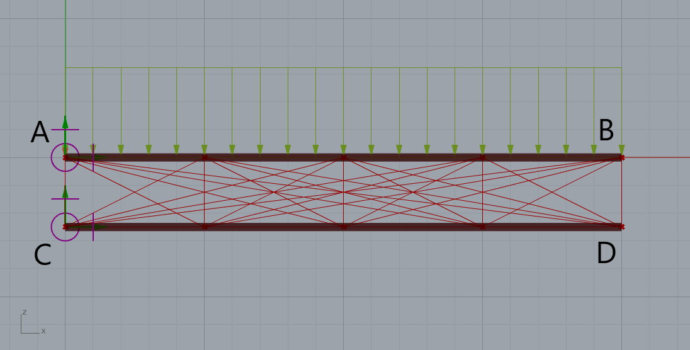

基点

- 点A( 0.0, 0.0, 0.0)
- 点C( 0.0, 0.0, -2.5)

先端

- 点B(20.0, 0.0, 0.0)
- 点D(20.0, 0.0, -2.5)

上弦材はABを結ぶ直線、下弦材はCDを結ぶ直線とし、端部は剛接合とします。上弦材・下弦材の断面は円形鋼管〇-400x19(SN490)とします。

AB間およびCD間をそれぞれ4等分して節点を設け、上弦材上の節点と下弦材上の節点を総当たりで結んだ線のうち選択したものをトラス材として解析に使用します。なお、トラス材の端部はピン接合とし、トラス材の断面は円形鋼管〇-267.4x9.3(SN490)とします。

鋼材SN490のヤング係数は、これまでと同じE=205000N/mm<sup>2</sup>(20500kN/cm<sup>2</sup>)とします。SN400とSN490はヤング係数は同じで降伏強度が異なります。

（※※Karamba3DのTrial版を使用している人は、20要素までしか解析ができません。今回の講義用にテンポラリライセンスを取得していますのでそちらを設定してください。）

## 2.3. 支点

点A及び点Cについて、Tx,Ty,Tz及びRx,Ry,Rz全て固定とします。

## 2.4. 荷重

積載荷重として上弦材にZ方向下向きの分布荷重30kN/mを作用させます。
また、自重を考慮することにします。

---

# 3. 解答例

## 3.1. コンポーネントの配置

コンポーネントの配置例の全体図を以下に示します。

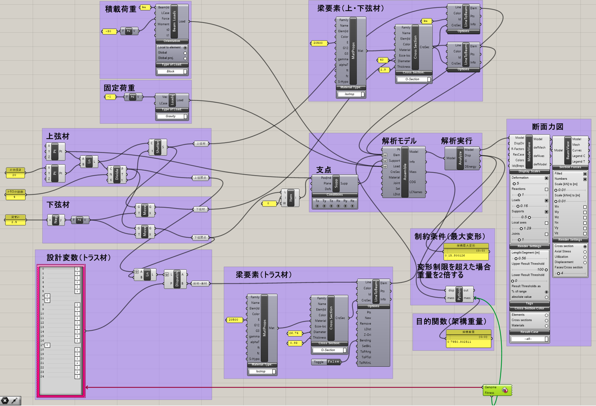

## 3.2. 架構の描画(コンポーネントによる描画)

### 3.2.1. 上・下弦材

節点Aと節点Bを定義し、AB間を上弦材として描画します。DivideCurveコンポーネントでAB間を等分し、Shutterコンポーネントで直線も分割します。
下弦材は上弦材を2.5m下にMoveコンポーネントで移動させます。(grasshopperではMoveコンポーネントはMove前のジオメトリも残りますので、実質コピーとなります。)

### 3.2.2. トラス材

上弦材及び下弦材を分割した節点が格納されたデータのどちらの片方データをGraftしてLINEコンポーネントで結びます。（Graftするとデータが一つのBranchに格納されます。）そうすると上下の節点間で総当たりの線が引けます。節点は5点ずつありますので、トラス材計25本の線が引かれます。

全てのトラス材を格納したLineコンポーネントをDispatchコンポーネントのList入力端子に接続します。このコンポーネントはPattern端子に入力されたBOOL値(1か0)でジオメトリの有無を定義します。

今回の演習ではトラス材の有無を設計変数としますので、GenePoolコンポーネントを配置し、遺伝子数を25個、入力値は0か1の整数に設定します。Gene PoolコンポーネントからDispatchコンポーネントのPattern端子に接続します。

DispatchコンポーネントのA端子からはTrue(1)が設定されたジオメトリが出力され、B端子からはFalse(0)が設定されたジオメトリが出力されます。どちらでも構いませんが、今回は最適解が見つけやすいB端子から出力されたものを使用します。

入力端子Listの接続部分で、Flattenしておきます。（Flattenしないとbranch毎にトラスの有無が設定されてしまいます。）


## 3.3. 架構の描画 (ghpythonによる描画)

ghpythonでの例を以下に示します。トラス材は二重ループとすることで描くことができます。

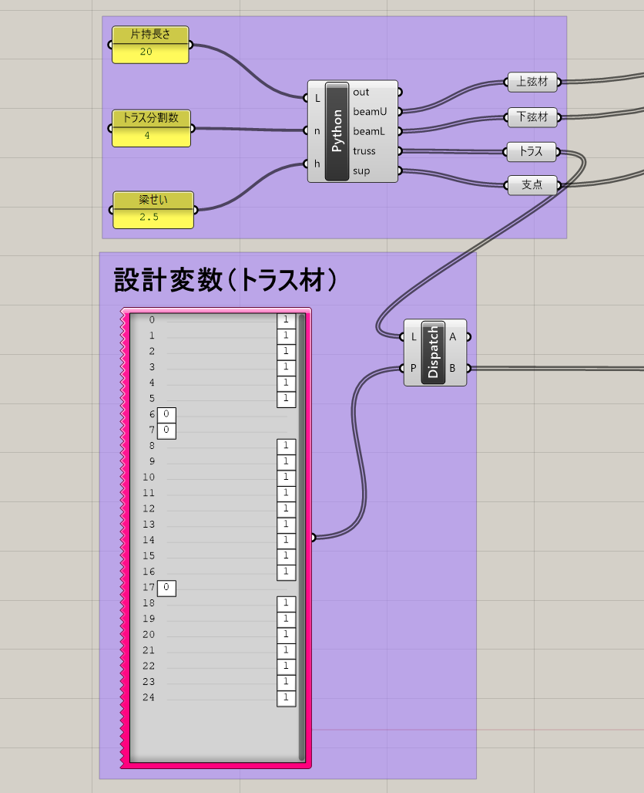

```python

import rhinoscriptsyntax as rs

# panelの値を数値に変換
n = int(n) # 整数に変換
L = float(L) # 実数に変換
h = float(h) # 実数に変換

# 節点位置の計算
ptU = []
ptL = []
for i in range( n+1 ):
    ptU.append( (L/n*i, 0, 0) )
    ptL.append( (L/n*i, 0, -h) )

# 上弦材・下弦材の描画
beamU = []
beamL = []
for i in range( n ):
    beamU.append( rs.AddLine( ptU[i], ptU[i+1] ))
    beamL.append( rs.AddLine( ptL[i], ptL[i+1] ))

# トラス材の描画（二重ループ）
truss = []
for i in range( n+1 ):
    for j in range( n+1 ):
        truss.append( rs.AddLine( ptU[i], ptL[j] ))

# 支点の描画
sup = []
sup.append(rs.AddPoint( ptU[0] ))
sup.append(rs.AddPoint( ptL[0] ))
```


## 3.4. 梁要素と荷重の定義

分布荷重は上弦材のみに作用させますので、LineToBeamコンポーネントは上弦材用、下弦材用、トラス材用の3つを配置します。
トラス材はBendingの入力端子にFalseを設定します。（Trueで両端剛接合、Falseで両端ピン接合が設定されます。）

このうち上弦材のみに荷重を作用させるので、IDに名称を付けます。このIDは分布荷重にも同じIDをつけておきます。

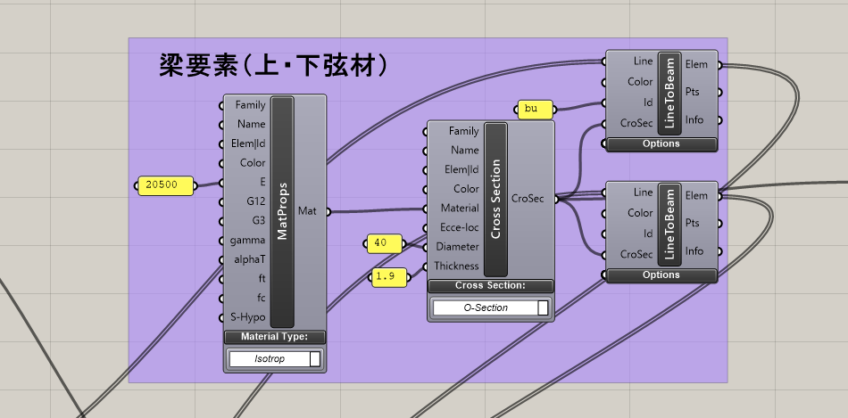
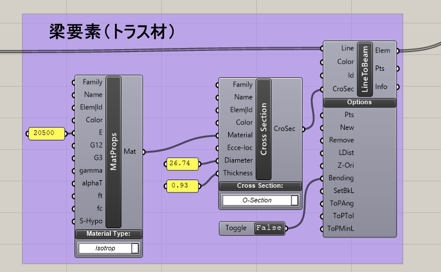

上弦材には積載荷重として30kN/mの下向きの荷重を作用させます。

自重を考慮するのでLoadsコンポーネントのGravityを設定し、Z方向下向きの荷重を作用させます。要素の比重はMaterialPropertyコンポーネントのgammaで必要に応じて定義します。今回は鋼材の標準値78.5kN/m<sup>3</sup>で計算します。


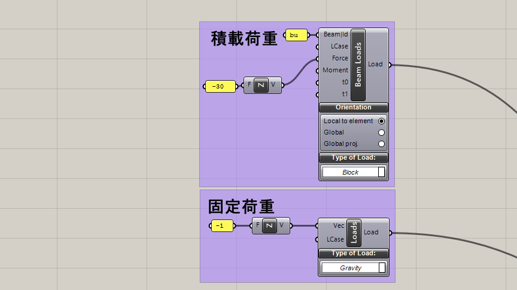

## 3.5. 解析モデルの構築

梁要素、支点、荷重条件AssembleModelコンポーネントに接続します。
下部の支点は下限材の節点から0番目をListItemコンポーネントで取り出します。
その際に、それぞれをFlattenしてデータ構造の階層をなくしておきます。（階層があると複数の解析モデルで解析が実行されてしまいます。）

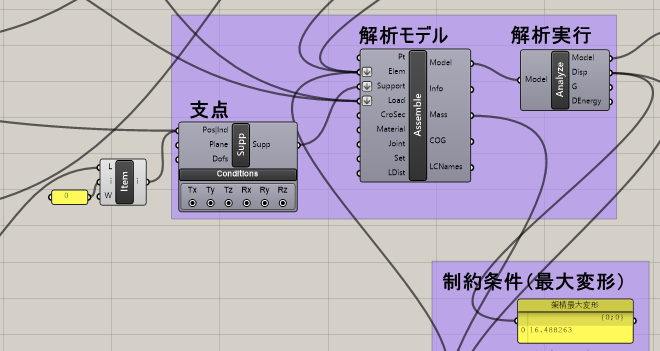

## 3.6. 最適化

この例ではgrasshopper標準で搭載されているGalapagosというコンポーネントを使用します。

このコンポーネントでは遺伝的アルゴリズム(Genetic Algorithm 略称GA)及び焼きなまし法(Simulated Annealing 略称SA)による最適化計算を行うことが可能です。今回はGAによる最適化を行います。
GAは設計変数を遺伝子とみなし、その組み合わせを生物の個体に見立てます。1世代あたり決められた個体数の集団を生成、評価し、優良な個体を残して次の世代の集団を生成するという仕組みです。

架構重量はAssembleModelコンポーネントのMass端子から取り出し、これを最小化する目的関数とします。

最大変形はAnalyzeコンポーネントのDisp端子から取り出します。以下のGHPythonコンポーネントで、変形が許容値の20cmを超えたら重量を増やすペナルティを与えることで制約条件を満足させます。入力変数としてdisp,massを設定し、出力変数としてmassを設定します。

```python
if disp > 20:
    mass = mass * 2
```

Galapagosをダブルクリックすると設定画面が表示されます。今回は鋼材重量の最小化を目的関数としていますので、Fitnessの設定をMinimizeとします。

- Threshold しきい値（目的関数がこの値に達したら最適化を終了する）
- Max.Stagnant 停滞世代数（この世代数最適解が更新されなければ最適化を終了）
- Population 世代毎の個体数
- Initial Boost 局所解を避けて幅広く回を探索するために第一世代の個体数に乗じる倍数
- Maintain 維持率（優秀な個体として残す比率）
- Inbreeding 交配率（交配させる比率）

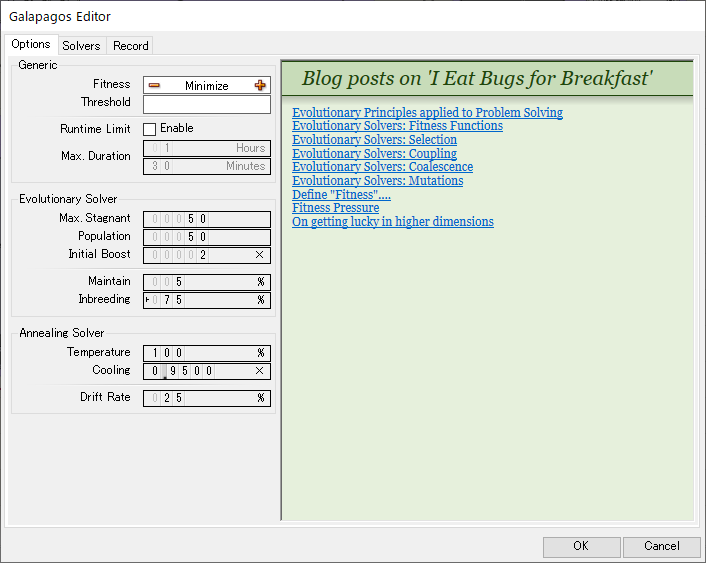

その他の設定はDefaultのままとして、SolversタブのStartSolverボタンで最適化が開始されます。

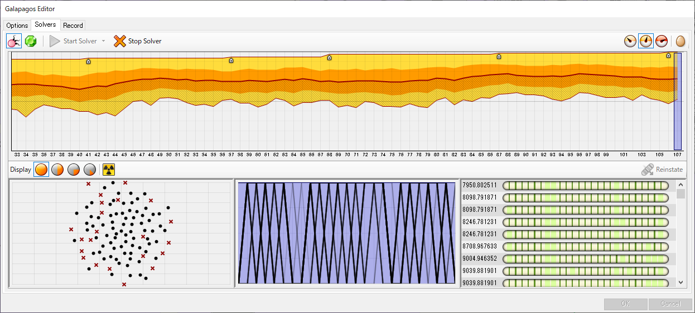

荷重条件によって、必要なトラス材の組み合わせが変わります。いくつか条件を変えてみて確認してみましょう。荷重を大きくしすぎると、最適解が見つからない可能性もあります。

今回のトラス配置の総組合せ数は2<sup>25</sup>=3355万通りあります。全部の組合せ数について検討を行えば、必ず最適解が見つかりますが、1回の解析に10msec(=0.01sec)を要したとすれば、93時間（4日程度）の計算時間が必要となります。

以下が最適解の例です。私のPC(macbook air M2プロセッサ)でおおよそ50集団×80世代、おおよそ1分で結果が得られました。最適化アルゴリズムを用いることで効率的に解が得られることがわかると思います。GAは乱数による選択アルゴリズムであるため、必ずしも最適解が得られるとは限りませんので注意が必要です。

また、下弦材の右側の2要素は構造的には明らかに不要な要素です。下弦材もトラスと同様に最適化を行えば、この2部材が無い最適解も得られると考えられますが、さらに2<sup>4</sup>倍の解析ケースが必要となります。


解析結果があまりにも違う場合、設定が違う可能性があります。
（必ずしもこの解が得られるとはかぎりません。）以下の点をチェクしてみてください。
- 節点の座標は正しく設定されているか
- トラス要素の境界条件がピンになっているか
- 各要素の断面形状および材料の数値が正しく設定されているか。
- 固定荷重および積載荷重は正しく入力されているか
- 最適化のFitnessがMinimizeに設定されているか
- 変形量が規定値を超えた場合のペナルティが正しく設定されているか
- 境界条件は正しく設定されているか
- 複数のデータが集まるところで、必要な部分でデータ構造がFlattenされているか


---

# 4. 片持トラス梁の最適化計算(部材断面の最適化)

## 4.1. 概要

前の課題と同様に長さ20mの片持ち梁の重量を最適化する例を紹介します。

制約条件は同じとし、トラス断面を設計変数にとって最適化します。講義の中では詳しくは説明しませんが参考にしてください。

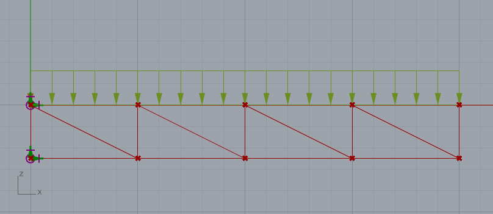

上弦材・下弦材・トラス材の断面を以下の4つの部材リストから選択して重量の最適化を行います。

〇-165.2x1.1
〇-213.6x1.27
〇-267.4x1.27
〇-318.5x1.27

## 4.2. コンポーネント配置例

以下にコンポーネントの配置例を示します。

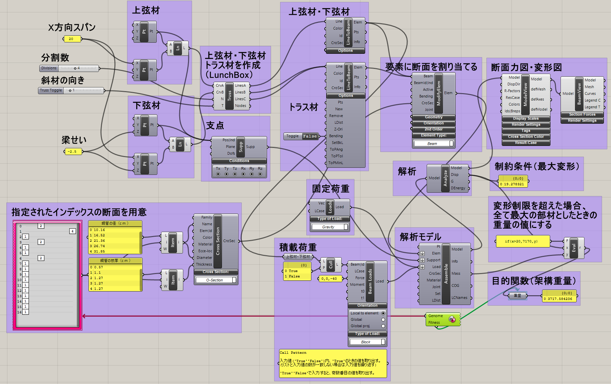


LunchBoxというコンポーネントを使って架構の描画を行っています。標準のコンポーネントではありませんので、使用する場合はFood4Rhinoからダウンロードしてください。

LunchBoxコンポーネントは上弦材のジオメトリ(Line)と下弦材のジオメトリ(Line)を入力し、分割数と斜材の向きを指定します。

出力側のLineA端子は上・下弦材、LineB端子は斜材、LineC端子は束材を出力します。LineAから出力される上・下限材は0,2,4...の偶数に上弦材、1,3,5...の奇数に下弦材が格納されていますので、この例ではCull Patternで抽出しています。Seriesで公差2の等差数列で抽出することもできます。

指定した5つの断面は直径と板厚に分けたパネルに保存し、ListItemコンポーネントでindexを指定して取り出します。GenePoolの数は全要素数17（上弦材4・下弦材4・束材5・斜材4）に設定し、数値の範囲は1～4の4種類として、断面リストの番号を指定し、ModifyBeamコンポーネントで断面性能を各要素に割り当てます。

## 4.3. 最適化計算の結果

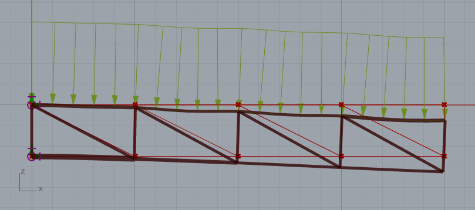

