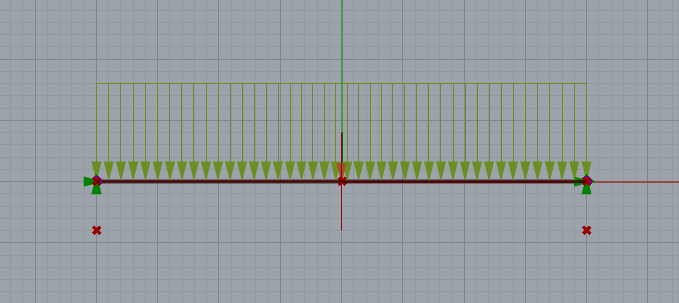

# デジタルエンジニアリング特論2022/6/2 構造演習4

## 演習課題４(橋梁の設計)

***※※現在作成中の講義資料です。時間を見つけて更新していきます。5/26（木）中までにはまとめます。※※***

### 設計条件

スパン40mの橋梁を最適化アルゴリズムを使って設計します。
以下に定められた条件のもと、部材の総重量を最小化するように架構を計画してください。梁の上下の空間は自由に使用してかまいません。

最適化における設計変数は部材断面・部材配置・部材座標など自由に設定して構いません。

#### 支点条件

使用する支点は以下の4点とします。

A(-20.0, 0.0,  0.0)

B(-20.0, 0.0, -4.0)

C( 20.0, 0.0,  0.0)

D( 20.0, 0.0, -4.0)

支点はいずれもピン支点（Tx,Ty,Tz,Rx,Rz：Fix Ry：Free）とします。

#### 荷重条件

- 人や車の往来が可能なように、AC間は梁で接続し積載荷重は分布荷重100kN/m(Z方向下向き)を作用させます。
- 部材自重を考慮してください。

#### 設計クライテリア

- 最大変形16cm（変形角1/250）以下
- 部材の応力度に対する検討は必要ありません。（もちろん行っても良い）

#### 使用材料及び接合

- 各部材の端部接合はモデル化の簡略化のため、剛接合とします。
- 使用材料は鋼材とし、ヤング係数E = 205000N/mm2( 20500kN/cm2 )とします。
- 使用する鋼材断面は円形鋼管とし、以下の部材から選択してください。断面は一種類しか使わなくても、複数組み合わせても構いません。（入力単位を間違わないように注意。データ設定によりますが標準はcmでの入力となります。）

    直径(mm)×板厚(mm)
    〇-101.6 x 5.7

    〇-165.2 x 11.0

    〇-213.6 x 12.7

    〇-267.4 x 12.7

    〇-318.5 x 12.7

####  注意事項

- 最適化にあたってGalapagos等の最適化コンポーネントを使用してください。
- コンポーネントは講義で使用していないものも使用してかまいません。また標準でインストールされていないコンポーネントも使用可としますが、Food4Rhinoからダウンロードできるものとしてください。
- コンポーネントの配置にあたっては、整列・グループ化・コメント記入など見やすいように配慮してください。
- 架構重量と最大変形はAnalyzeコンポーネントの**mass及びdisp端子からキャンパス上のPanelに出力**してください。
- 検討条件（ヤング係数、荷重、支点条件など）は間違わないようにしてください。特に単位に注意
- Karamba3Dの出力設定
    - ModelViewコンポーネント DisplayScales / DefomationのみON：スライダーは適切な値
    - BeamViewコンポーネント RenderSettings / CrossSectionのみON

- 提出物は以下の二つとします。
    - grasshoopperファイル：ファイル名「2HE00000A_bridge.gh」
        (ghファイルは**最適化された状態のgene poolもしくはnumber sliderの設定としてください**)
    - 最適化された架構の画像ファイル：ファイル名「2HE00000A_bridge.png」もしくは「2HE00000A_bridge.jpg」
        (RhinocerosのFrontウィンドウをキャプチャしてください)

    

####  評価

架構計画の合理性、コード（コンポーネント配置）の見やすさ、独創性、意匠性を総合して評価します。

