# デジタルエンジニアリング特論2022/6/2 構造演習4

##  6/1時点提出状況

6/1時点で提出されている最適化架構は以下の3タイプに区分されます。

---
## タイプ1
1. パラメーター：トラス材有無

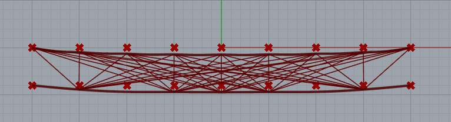

2. パラメーター：トラス材有無

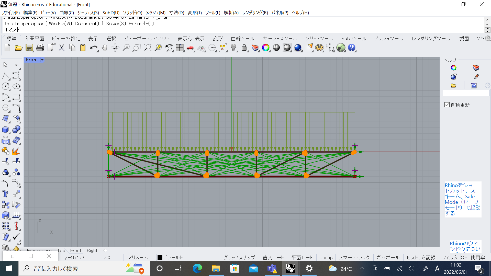

3. パラメーター：トラス材有無

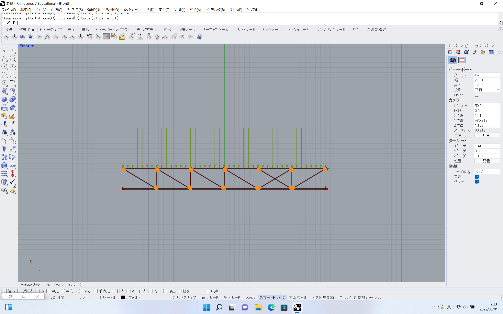

4. パラメーター：トラス材有無

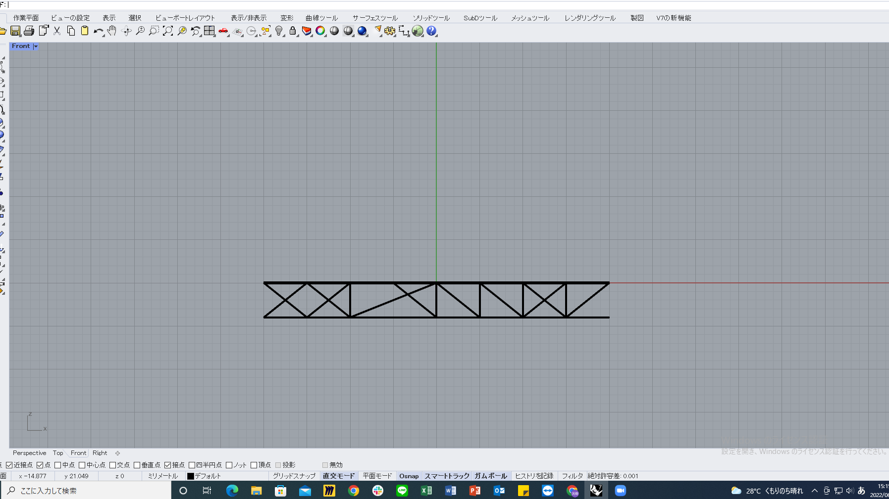

5. パラメーター：トラス材有無

（genepoolの数が多い必要25に対して29）
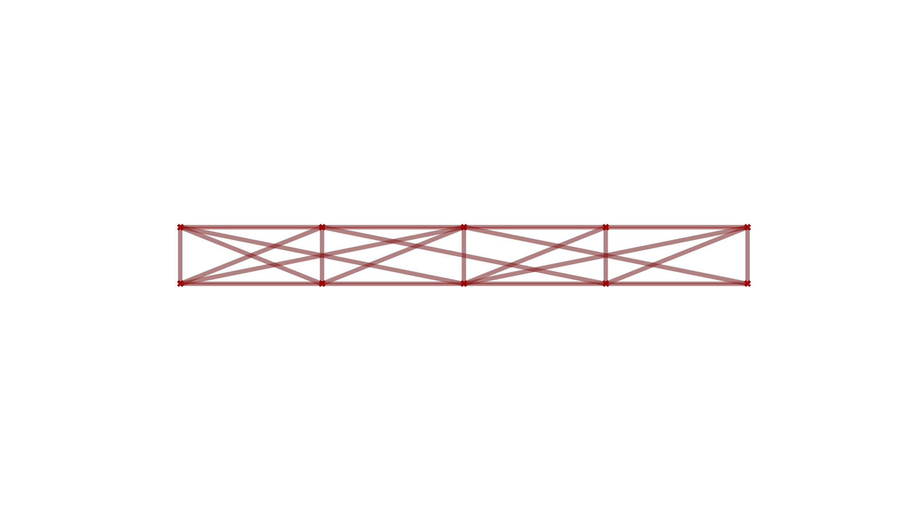

6. パラメーター：トラス材有無
（変形制限14cm）

7. パラメーター：トラス材有無 

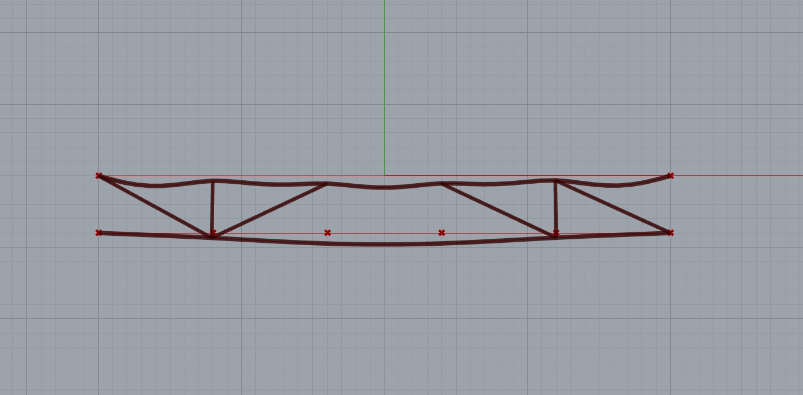

---
8. パラメーター：トラスの有無と断面
（断面割り当てとゲノム数が一致していない）

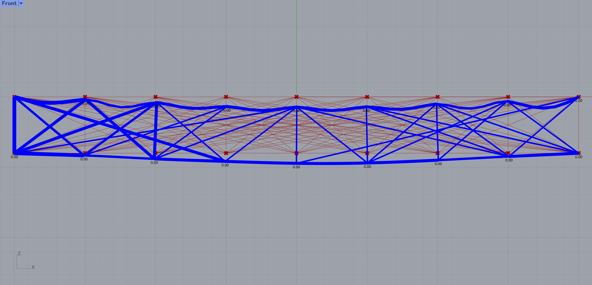

---
## タイプ2
9. パラメーター：アーチ高さとトラス材の有無 ※
（分布荷重確認）

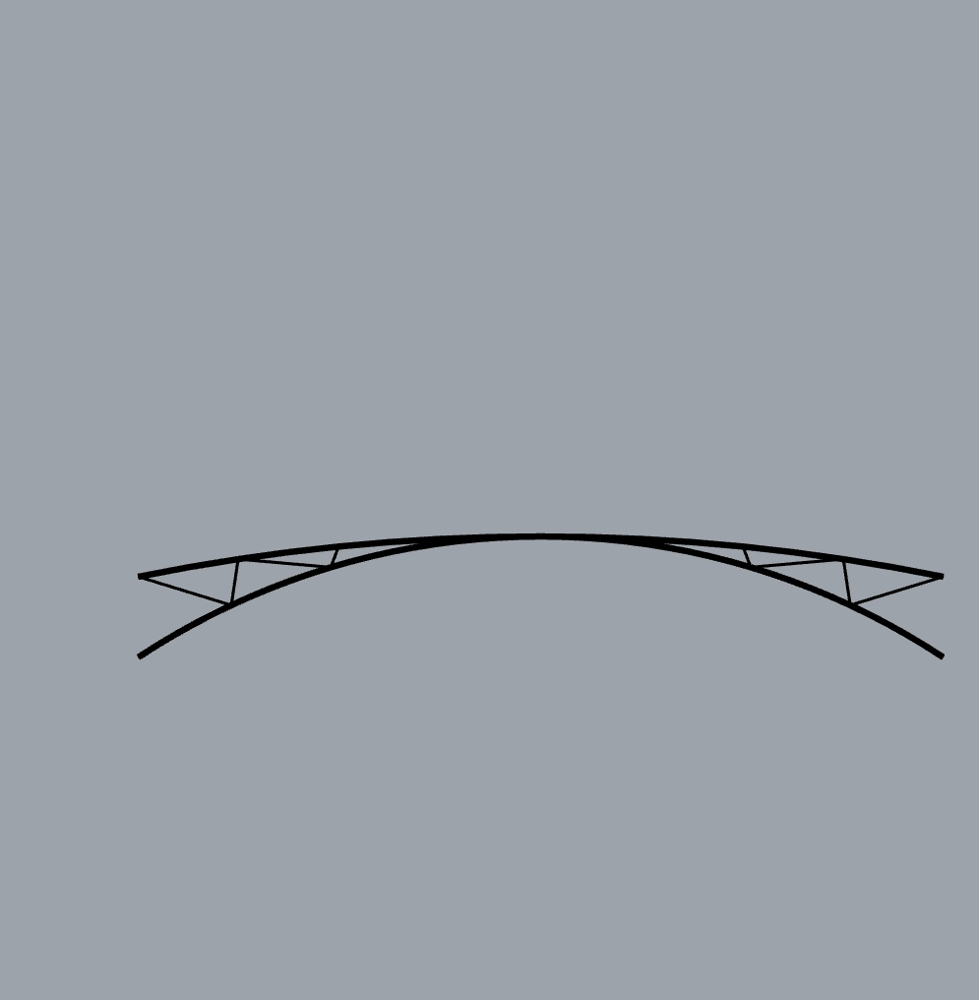

10. パラメーター：下弦材位置・分割数・トラス材の有無（トラス位置はグリッド毎）

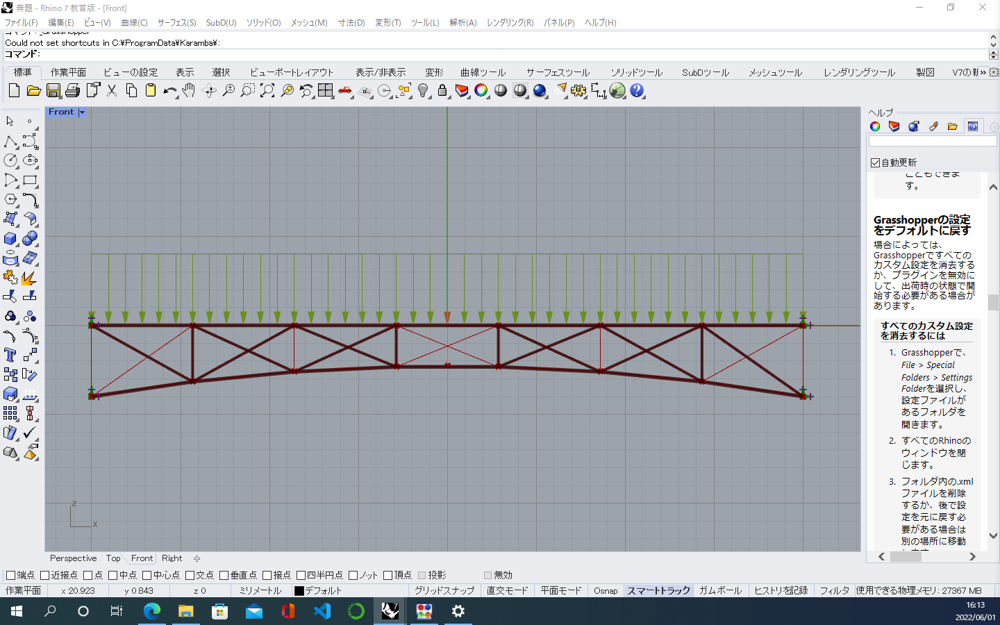

11. パラメーター：断面の最適化
（支点条件の設定に誤り）

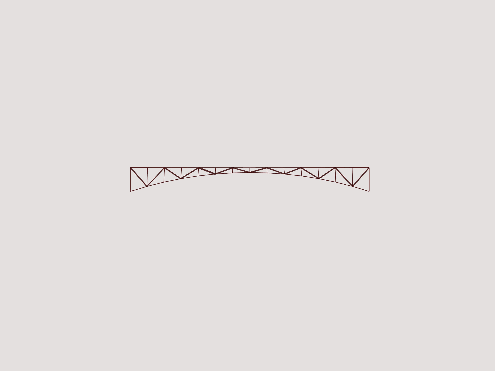

12. パラメーター：アーチライズとトラスの有無 ※

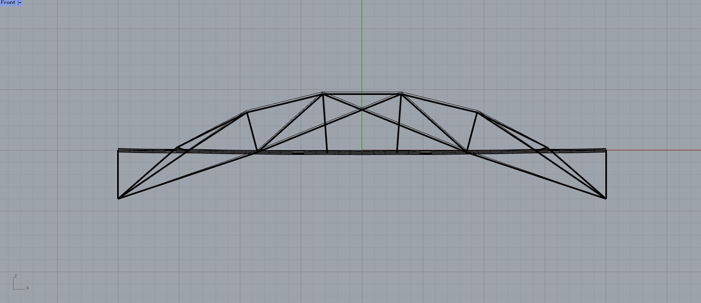

13. パラメーター：下弦材の位置
（断面寸法の単位違い）

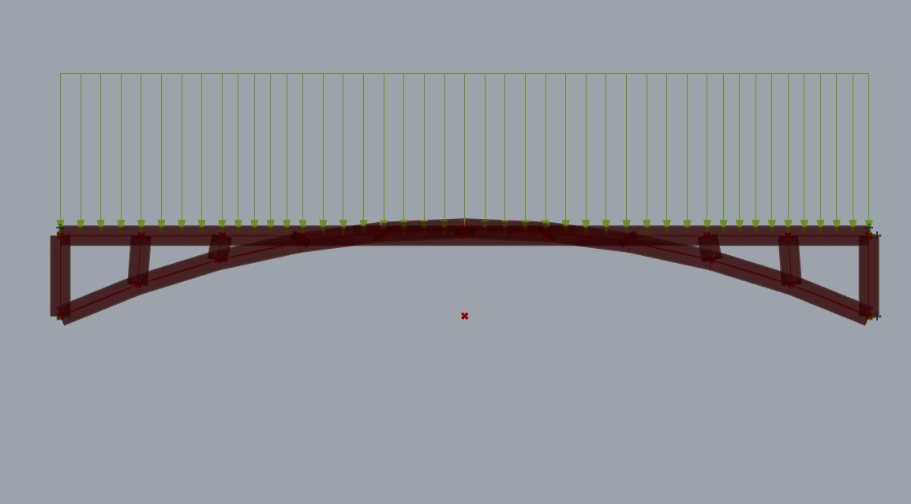

---
## タイプ3

14. パラメーター：方立材の有無と断面
（genepool数が方立数と一致していない）

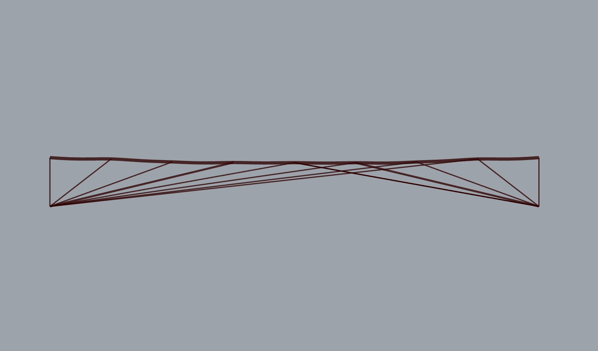

15. パラメーター：方立材の有無と断面
（genepool数が方立数と一致していない）

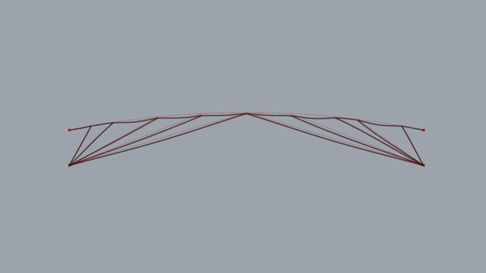

### まとめ

提出数 15 （2022/06/01 17：00時点）
重量の軽いもののベスト3

|  順位  |  重量  |
| ---- | ---- |
|  1位  |  6002kN |
|  2位  |  6604kN |
|  3位  |  6826kN |

（最適化条件に明確な誤りを含むもの2件を除く）

- 最大変形平均値 15.0cm
- 最適化重量平均値 13534kN

